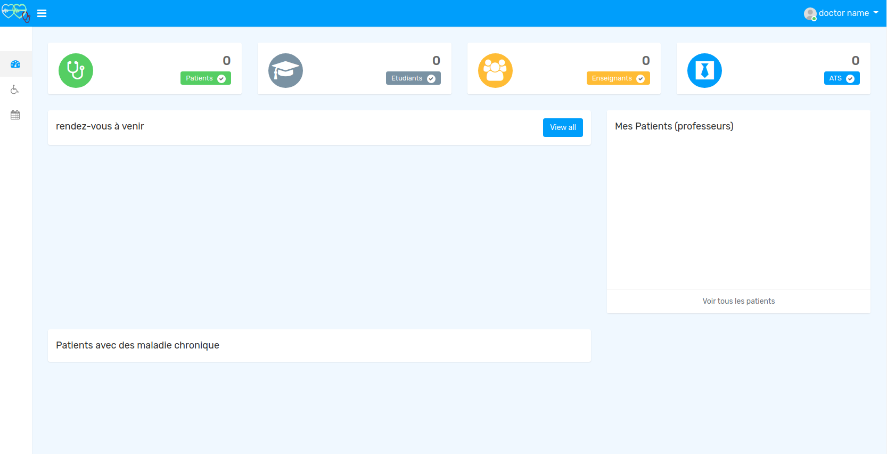

# Clinic Dashboard for School (version 1.0)
> Simple dashboard for patient management in a school. 
## Table of Contents
* [General Info](#general-information)
* [Technologies Used](#technologies-used)
* [Features](#features)
* [Screenshots](#screenshots)
* [Setup](#setup)
* [Project Status](#project-status)
* [Room for Improvement](#room-for-improvement)
* [Contact](#contact)
<!-- * [License](#license) -->

## General Information

- Create profiles for students, professors and stuff.
- The profile will contain all details about the patients
- It allows booking appointments for patients

## Technologies Used
- Laravel - version 5.8
- PHP - version 7.2
- HTML 5
- CSS 3
- bootstrap - version 4
- Javascript

## Features
- Creating user profiles
- Edit/Delete profile
- Statistics
- Booking appointments
- Responsive application

## Screenshots

<!-- If you have screenshots you'd like to share, include them here. -->

## Setup
- **Clone** your project
- Go to the folder application using cd command on your cmd or terminal
- **Run** **_composer install_** on your cmd or terminal
- Copy **.env.example** file to **.env** on the root folder. You can type copy .env.example .env if using command prompt Windows or cp .env.example .env if using terminal, Ubuntu
- Open your .**env** file and change the database name (_**DB_DATABASE**_) to whatever you have, username (DB_USERNAME) and password (DB_PASSWORD) field correspond to your configuration.
- By default, the username is root and you can leave the password field empty. (This is for Xampp)
- By default, the username is root and password is also root. (This is for Lamp)
####
- ###### Run:
- **_php artisan key:generate_**
- **_php artisan make:seeder UserSeeder_**
- **_Run php artisan migrate_**
- **_php artisan serve_**
####
- Go to **localhost:8000**

## Project Status
Project is: _in progress_.

## Room for Improvement
areas i believe need improvement / could be improved.

Room for improvement:
- UI/UX (Design).
- Allow users to login to their accounts and sees their records.
- Use the power of AI for diagnosis and predict future illness.

## Contact
Created by [@mokriabdelhak](https://github.com/mokri) - feel free to contact me!

This project is open source

<!-- Optional -->
<!-- ## License -->
<!-- This project is open source and available under the [... License](). -->

<!-- You don't have to include all sections - just the one's relevant to your project -->
